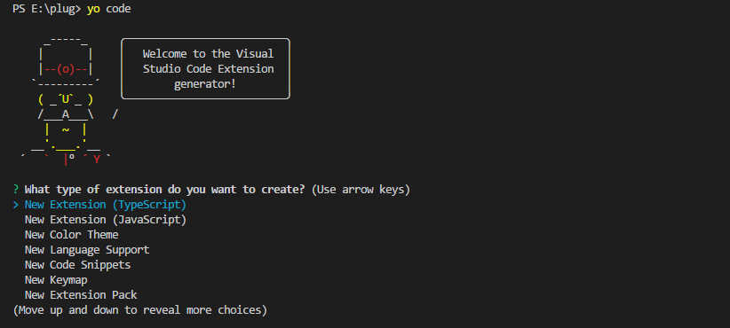
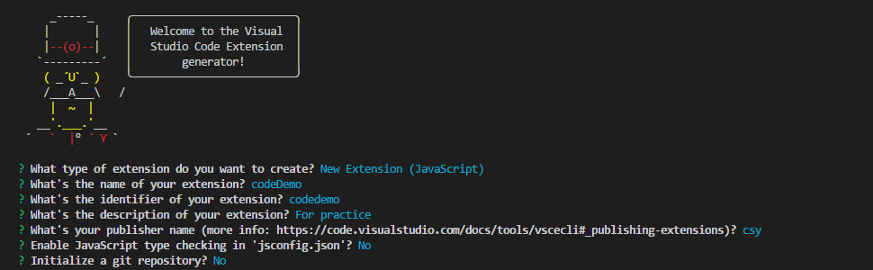
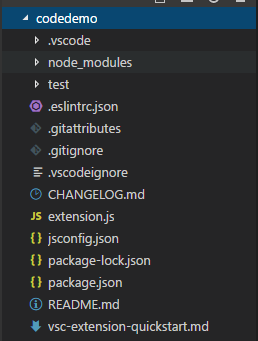
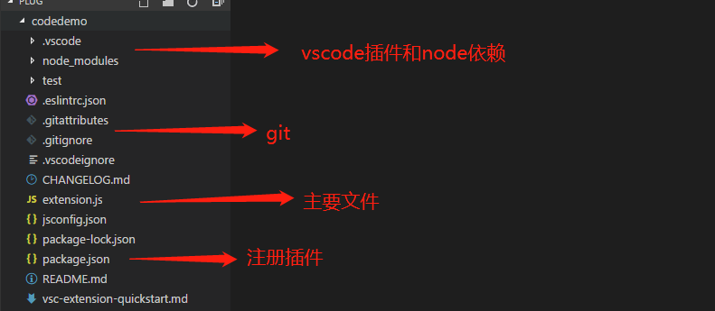

# 从零开始的vs code之旅

## 前言

近期学习了一下vs code的制作，因为踩了一些坑，也来跟大家分享一下，从零开始我的vs code之旅，因为网上这类相关的文章比较少，我会比较细致的讲解每一步，并且附上一个demo。

### 一、开发环境介绍与安装
1、第一步当然是装个vs code啦。校宝标配，大家应该都有。没有的话，后面这个是链接[click this link](https://code.visualstudio.com/) 。

2、node.js就不说了[click this link](http://nodejs.cn/download/) 。

3、npm install -g yo generator-code 打开cmd来执行下面的命令来安装这个，这是生产插件代码的东西。

4、若果上面的都成功了之后，打开cmd输入yo code。你就会看到如下图：

### 二、创建项目
1、首先我们会看到让你选择插件的类型，我们这里选择JavaScript。

2、选择相关配置项，然后它会自动执行 npm install 来加载vscode这个依赖。也可以直接X掉，自己用 cnpm install 来安装，没有影响，可以直接关闭。

3、当当当挡。于是就有了下面这个文件夹。

### 三、结构介绍
